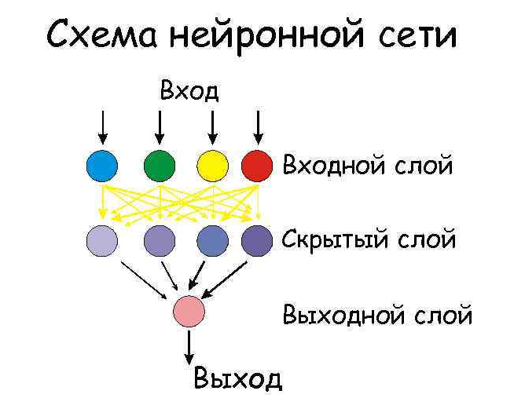

Для создания нейронных сетей будем использовать библиотеку Keras. Создать сеть можно двумя способами - с помощью 
**Sequential** и **Functional API**. Рассмотрим первый способ.

## Sequential
Создание каркаса модели сети прямого распространения (с последовательными слоями, идущими друг за другом):
```python
model = Sequential()
```
C помощью метода **add** мы добавляем первый слой или присоединяем слой к последнему созданному:
```python
model.add(<слой>)
```
Мы можем взять в качестве первого слоя **Dense(<Число нейронов в слое>,<Параметры>)** каждый нейрон которого 
связан с каждым нейроном прошлого слоя или со всеми входными параметрами, если слой первый. И, используя параметры 
**input_dim** (количество входных параметров, для первого слоя указывать обязательно, дальше автоматически), 
**use_bias** (использование нейрона смещения), создать 2 слоя в модели:

```python
model = Sequential()

model.add(Dense(4, input_dim=4, use_bias=False))

model.add(Dense(1, use_bias=False))
```

